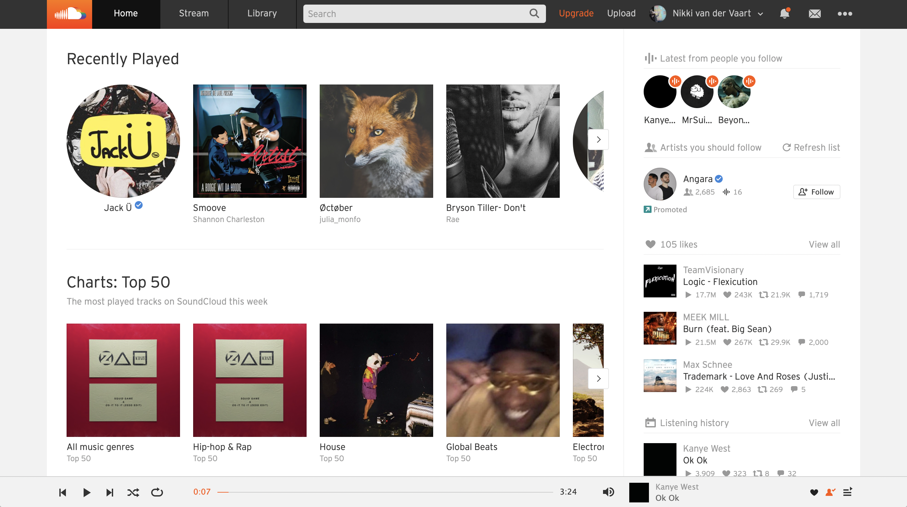
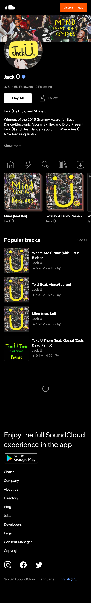
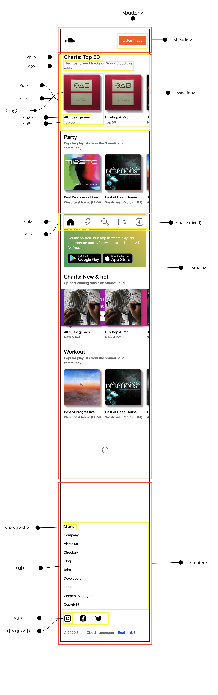

# Procesverslag
Markdown is een simpele manier om HTML te schrijven.  
Markdown cheat cheet: [Hulp bij het schrijven van Markdown](https://github.com/adam-p/markdown-here/wiki/Markdown-Cheatsheet).

Nb. De standaardstructuur en de spartaanse opmaak van de README.md zijn helemaal prima. Het gaat om de inhoud van je procesverslag. Besteedt de tijd voor pracht en praal aan je website.

Nb. Door *open* toe te voegen aan een *details* element kun je deze standaard open zetten. Fijn om dat steeds voor de relevante stuk(ken) te doen.

## Jij

uitwerken voor kick-off werkgroep

### Auteur:
Nikki van der Vaart

#### Je startniveau:
Rood

#### Je focus:
Surface Plane en Responsive
 

## Je website

uitwerken voor kick-off werkgroep

### Je opdracht:
<a href="url">https://soundcloud.com/discover<a>

#### Screenshot(s) van de eerste pagina (small screen): 
Home Page 

#### Screenshot(s) van de tweede pagina (small screen):
Artist Page 

 

## Breakdownschets (week 1)

uitwerken na afloop 2e werkgroep

### de hele pagina: 

### dynamisch deel (bijv menu): 

### wellicht nog een dynamisch deel (bijv filter): 

## Voortgang 1 (week 2)

uitwerken voor 1e voortgang

### Stand van zaken
De breakdown schetsen gingen wel goed, ik kon alle html elementen identificeren. Wat ik lastig vond was niet het starten van de html maar het verzamelen van content. Niet alle afbeeldingen waren te vinden op de website waar ik de afbeelding kan downloaden. Dus ik moest screenshots maken en verzorgen dat alle afbeelding de zelfde maat waren en kwaliteit. Maar in het eind was alles goed gekomen!

### Agenda voor meeting
<strong>Agenda Summary</strong>
Voorbereiding:
- Ik had geen vragen voor de gesprek. Alles was gelukt met mijn HTML en wou alleen dat het gecheckt werdt.

### Verslag van meeting
- h2, h3, h4 etc moeten eerst dan img
- alleen 1 h1 hebben, de rest h2, h3, h4 etc. 

Voor dit eerste gesprek had ik alle HTML klaar gemaakt van mijn eerste website. De meeste dingen waren goed behalve dat ik de images boven de h2 had, en eigenlijk moet de h2 eerst en dan de img. Ik had ook meerdere h1 en je mag er alleen 1 in je HTML hebben, vandaar heb ik de rest naar h2 en h3 verandert. 

## Voortgang 2 (week 3)

uitwerken voor 2e voortgang

### Stand van zaken
Deze week ben ik begonnen met de CSS van mijn eerste pagina. Om dit af te hebben op tijd voor de gesprek heb ik de werk verdeelt en dan kon ik ook goed focusen op een gedeelte, in plaats van alles te proberen te doen. Dit ging wel goed voor mij gevoel want ik begon gewoon bij de header en hier had ik geen problemen. In de main had ik well een paar problemen, bijvoorbeeld om de order te veranderen van HTML elementen was lastig, maar de probleem was dat ik de verkeerde element had geselecteerd! Dus het was een makkelijke fix. Voor de rest ging het best wel lekker. 

### Agenda voor meeting
<strong>Agenda Summary</strong>
Voorbereiding:
- De vragen die ik had waren in de werkgroep beantwoord en dus was mijn CSS gewoon klaar voor de eerste pagina en moest alleen wat feedback krijgen van de docent.

### Verslag van meeting
- logo moet wat kleiner 
- navigatie moet ook een ul/li worden want het is in principe gewoon een lijst
- sommige links werken niet omdat ik de # miste bij de href, dus dit moet ik toeveogen
- Ik moet de bron vermelden van waar ij de Eric Meyer css reset heb gebruikt 
- Voor de header styling het ik de button met position absolute gestijled maar dat is niet nodig, ik kan gewoon flexbox gebruiken om de stijl te bereiken.

In het algemeen was alles goed, alleen een paar kleine details die ik moet fixen/veranderen en ook wat leuke elementen (animatie, JS) toeveogen zodat ik een goede cijfer kan halen. Ik ben erg blij met de feedback en dat ik goed op weg ben! Nu ben ik klaar om met de tweede pagina te beginnen. 

## Toegankelijkheidstest (week 4)

uitwerken na test in 8e voortgang

### Bevindingen
Lijst met je bevindingen die in de test naar voren kwamen:

#### Titel eerste bevinding
Hier korte omschrijving (met indien nodig een afbeelding)

Hier een omschrijving van hoe het opgelost kan worden (met indien nodig een afbeelding)

#### Titel tweede bevinding. 
Hier korte omschrijving (met indien nodig een afbeelding)

Hier een omschrijving van hoe het opgelost kan worden (met indien nodig een afbeelding)

#### Titel volgende bevinding. 
Hier korte omschrijving (met indien nodig een afbeelding)

Hier een omschrijving van hoe het opgelost kan worden (met indien nodig een afbeelding)

#### Titel nog een bevinding. 
Hier korte omschrijving (met indien nodig een afbeelding)

Hier een omschrijving van hoe het opgelost kan worden (met indien nodig een afbeelding)

## Voortgang 3 (week 4)

uitwerken voor 3e voortgang

### Stand van zaken
hier dit ging goed & dit was lastig (neem ook screenshots op van delen van je website en code)

### Agenda voor meeting
samen met je groepje opstellen

| student 1      | student 2          | student 3    | student 4        |
| ---            | ---                | ---          | ---              |
| dit bespreken  | en dit             | en ik dit    | en dan ik dat    |
| en dat ook nog | dit als er tijd is | nog een punt | dit wil ik zeker |
| ...            | ...                | ...          | ...              |

### Verslag van meeting
hier na afloop snel de uitkomsten van de meeting vastleggen

- punt 1
- punt 2
- nog een punt
- ...

## Eindgesprek (week 5)

uitwerken voor eindgesprek

### Stand van zaken
hier dit ging goed & dit was lastig (neem ook screenshots op van delen van je website en code)

### Screenshot(s)

hier screenshot(s) van je eindresultaat

## Bronnenlijst

continu bijhouden terwijl je werkt

Nb. Wees specifiek ('css-tricks' als bron is bijv. niet specifiek genoeg).

1. bron 1
2. bron 2
3. ...

