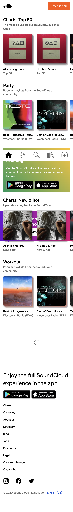

# Procesverslag
Markdown is een simpele manier om HTML te schrijven.  
Markdown cheat cheet: [Hulp bij het schrijven van Markdown](https://github.com/adam-p/markdown-here/wiki/Markdown-Cheatsheet).

Nb. De standaardstructuur en de spartaanse opmaak van de README.md zijn helemaal prima. Het gaat om de inhoud van je procesverslag. Besteedt de tijd voor pracht en praal aan je website.

Nb. Door *open* toe te voegen aan een *details* element kun je deze standaard open zetten. Fijn om dat steeds voor de relevante stuk(ken) te doen.

## Jij

uitwerken voor kick-off werkgroep

### Auteur:
Nikki van der Vaart

#### Je startniveau:
Rood

#### Je focus:
Surface Plane en Responsive
 

## Je website

uitwerken voor kick-off werkgroep

### Je opdracht:
<a href="url">https://soundcloud.com/discover<a>

#### Screenshot(s) van de eerste pagina (small screen): 
Home Page 

#### Screenshot(s) van de tweede pagina (small screen):
Artist Page 

 

## Breakdownschets (week 1)

uitwerken na afloop 2e werkgroep

### de hele pagina: 

### dynamisch deel (bijv menu): 

## Voortgang 1 (week 2)

uitwerken voor 1e voortgang

### Stand van zaken
De breakdown schetsen gingen wel goed, ik kon alle html elementen identificeren. Wat ik lastig vond was niet het starten van de html maar het verzamelen van content. Niet alle afbeeldingen waren te vinden op de website waar ik de afbeelding kan downloaden. Dus ik moest screenshots maken en verzorgen dat alle afbeelding de zelfde maat waren en kwaliteit. Maar in het eind was alles goed gekomen!

### Agenda voor meeting
<strong>Agenda Summary</strong>
Vragen:
- Ik had geen vragen voor de gesprek. Alles was gelukt met mijn HTML en wou alleen dat het gecheckt werdt.

### Verslag van meeting
- h2, h3, h4 etc moeten eerst dan img
- alleen 1 h1 hebben, de rest h2, h3, h4 etc. 

Voor dit eerste gesprek had ik alle HTML klaar gemaakt van mijn eerste website. De meeste dingen waren goed behalve dat ik de images boven de h2 had, en eigenlijk moet de h2 eerst en dan de img. Ik had ook meerdere h1 en je mag er alleen 1 in je HTML hebben, vandaar heb ik de rest naar h2 en h3 verandert.

 

## Voortgang 2 (week 3)

uitwerken voor 2e voortgang

### Stand van zaken
Deze week ben ik begonnen met de CSS van mijn eerste pagina. Om dit af te hebben op tijd voor de gesprek heb ik de werk verdeelt en dan kon ik ook goed focusen op een gedeelte, in plaats van alles te proberen te doen. Dit ging wel goed voor mij gevoel want ik begon gewoon bij de header en hier had ik geen problemen. In de main had ik well een paar problemen, bijvoorbeeld om de order te veranderen van HTML elementen was lastig, maar de probleem was dat ik de verkeerde element had geselecteerd! Dus het was een makkelijke fix. Voor de rest ging het best wel lekker. 

### Agenda voor meeting
<strong>Agenda Summary</strong>
Vragen:
- De vragen die ik had waren in de werkgroep beantwoord en dus was mijn CSS gewoon klaar voor de eerste pagina en moest alleen wat feedback krijgen van de docent.

### Verslag van meeting
- logo moet wat kleiner 
- navigatie moet ook een ul/li worden want het is in principe gewoon een lijst
- sommige links werken niet omdat ik de # miste bij de href, dus dit moet ik toeveogen
- Ik moet de bron vermelden van waar ij de Eric Meyer css reset heb gebruikt 
- Voor de header styling het ik de button met position absolute gestijled maar dat is niet nodig, ik kan gewoon flexbox gebruiken om de stijl te bereiken.

In het algemeen was alles goed, alleen een paar kleine details die ik moet fixen/veranderen en ook wat leuke elementen (animatie, JS) toeveogen zodat ik een goede cijfer kan halen. Ik ben erg blij met de feedback en dat ik goed op weg ben! Nu ben ik klaar om met de tweede pagina te beginnen. 

## Toegankelijkheidstest (week 4)

uitwerken na test in 8e voortgang

### Bevindingen
- met screenreader is het belangrijk dat het de goedeinformatie verteld en ook in een goede orde, anders is het niet duidelijk.
- contrast kan veranderen met kleur blind mensen
- belangrijk om alle klikbaare dingen duidelijk te maken en dat mensen doorheen kunnen klikken zonder trackpad.
- Je moet ervoor zorgen dat de text wat groter is voor mensen met slecthe ogen.

#### Titel eerste bevinding
<strong>Hemifield Loss:</strong>
- niks was moeilijk om te lezen want je kan nog de schermv oor je zien.
- de enige ding dat zou moeilijk zijn is als je vanaf een mobiel zit en kijkt van de onderkant of zijkant. 

#### Titel tweede bevinding. 
<strong>Color</strong>
- alles kreeg een gele kleur
- wit was geel, oranje, was meer een rood
- dus als het contrast van de kleuren veranderen dan moet je dit wel aanpassen zodat het duidelijk blijft voor iedereen.

#### Titel volgende bevinding. 
<strong>Blurry</strong>
- tekst was moelijker te lezen
- groote tekst/bold tekts was wel te zien en leesbaar
- kleine text/dunner tekst was niet leesbaar
- hier zou je de tekst grote kunnen aanpassen zodat er geen tekst die heel klein is 

#### Titel nog een bevinding. 
<strong>Screenreader</strong>
- leest h2 eerst voor de img maar in principe is dit beter want dan weten ze wat dit afbeelding betekent.
- alles zit in goed order

## Voortgang 3 (week 4)

uitwerken voor 3e voortgang

### Stand van zaken
Ik had de HTML van mijn tweede pagina al gestart en dus moest alleen verder gaan met de CSS. De HTML ging prima maar de CSS was een beetje lastiger. Ik moest er over na denken hoe ik ermee ging met het gebruiken van 1 CSS bestand voor 2 HTML bestanden. In het eind had ik besloten om de body's een class te geven zodat ik de tweed pagina kon stylen. Dit ging heel goed! 

### Agenda voor meeting
<strong>Agenda Summary</strong>
Vragen:
- Vraag hoe je de iconen krijgt (kan ze niet vinden in image extractor).
- Hoe krijg je de "show more" "show less" feature
- Waarom werkt mijn z-index niet
- buttons naast elkaar krijgen

### Verslag van meeting
- Iconen krijg je vanuit de code can de originele website, ze zijn svgs dus je kan die code copieren
- show more show less doe je met JS, met classlists en text.content
- z-index werkt alleen als de element positioned is 
- buttons kunnen als een unordered list worden end an met flexbox naast elkaar komen

Ik kreeg veel nuttige feedback en ben klaar om door te werken! Nu kan ik verder werken met de CSS en alle kleine details afmaken. De balngrijkste dingen die ik nog moet doen is de site wat meer responsive maken, JS toevoegen, wat meer content toevoegen aan beide sites en wat meer animaties toevoegen.

## Eindgesprek (week 5)

uitwerken voor eindgesprek

### Stand van zaken
Alles ging well goed bij het afmaken, de eneige ding dat heel lastig was was de JS om de show more show less feature te doen. Ik had veel opgezocht en kon het een beetje begrijpen maar uitendelijk heb ik een klasgenoot gevraagd om mij hierme te helpen. Het bleek ui dat er ging iets fout ging met de classes toevoegen en dan de code leesde de children niet. Maar in het eind was het opgelost met het veranderen van de span naar een div en ervoor te zorgen dat de JS de goede class toevoegd aan de HTML.

### Screenshot(s)

## Bronnenlijst

continu bijhouden terwijl je werkt

Nb. Wees specifiek ('css-tricks' als bron is bijv. niet specifiek genoeg).

1. https://www.w3schools.com/css/css3_gradients.asp —> gradient background 
2. https://www.codegrepper.com/code-examples/css/how+to+get+rid+of+bullet+points+in+css —> getting rid of bullet points
3. https://www.starr.net/is/type/htmlcodes.html —> “ü” code 
4. https://www.geeksforgeeks.org/how-to-create-show-more-and-show-less-functionality-for-hiding-text-using-javascript/ —> show more show less

